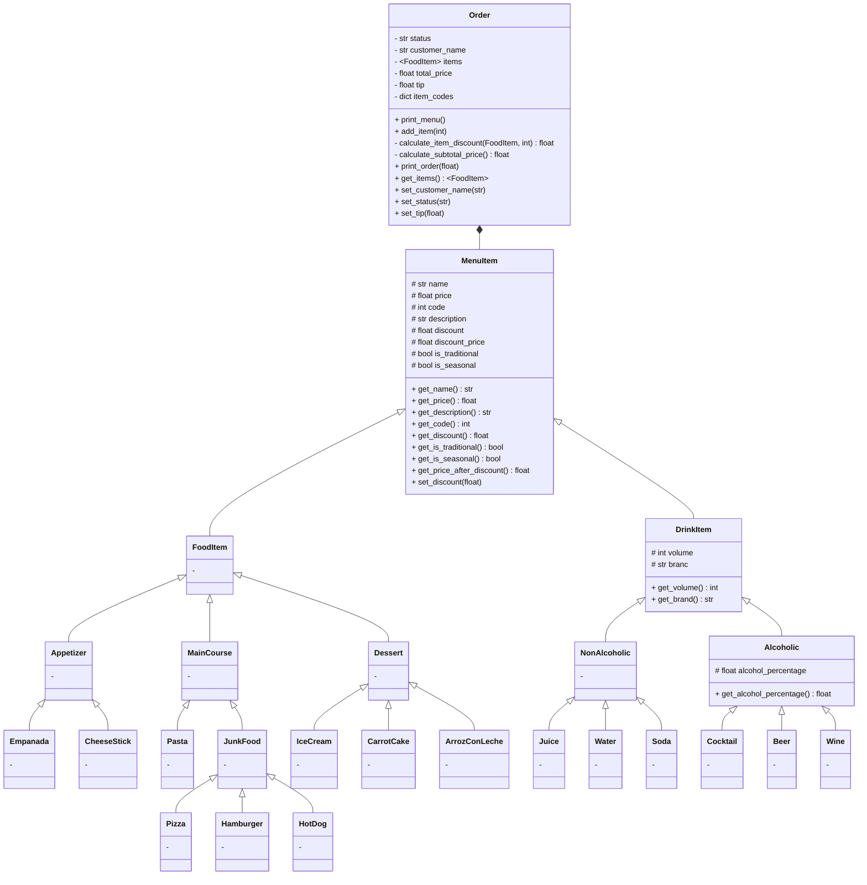

# OOP_reto_05

# Restaurant: 

```mermaid

classDiagram
direction BT

class Order {
    - str status
    - str customer_name
    - ~FoodItem~ items
    - float total_price
    - float tip
    - dict item_codes

    + print_menu()
    + add_item(int)
    - calculate_item_discount(FoodItem, int) float
    - calculate_subtotal_price() float
    + print_order(float)
    + get_items() ~FoodItem~
    + set_customer_name(str)
    + set_status(str)
    + set_tip(float)
}
MenuItem --* Order

class MenuItem {
    # str name
    # float price
    # int code
    # str description
    # float discount
    # float discount_price
    # bool is_traditional
    # bool is_seasonal

    + get_name() str
    + get_price() float
    + get_description() str
    + get_code() int
    + get_discount() float
    + get_is_traditional() bool
    + get_is_seasonal() bool
    + get_price_after_discount() float
    + set_discount(float)
}

class FoodItem {
    -
}
FoodItem --|> MenuItem


class Appetizer {
    -
}
Appetizer --|> FoodItem

class Empanada {
    -
}
Empanada --|> Appetizer

class CheeseStick {
    -
}
CheeseStick --|> Appetizer


class MainCourse {
    -
}
MainCourse --|> FoodItem

class Pasta {
    -
}
Pasta --|> MainCourse


class JunkFood {
    -
}
JunkFood --|> MainCourse

class Pizza {
    -
}
Pizza --|> JunkFood

class Hamburger {
    -
}
Hamburger --|> JunkFood

class HotDog {
    -
}
HotDog --|> JunkFood


class Dessert {
    -
}
Dessert --|> FoodItem

class IceCream {
    -
}
IceCream --|> Dessert

class CarrotCake {
    -
}
CarrotCake --|> Dessert

class ArrozConLeche {
    -
}
ArrozConLeche --|> Dessert


class DrinkItem {
    # int volume
    # str branc

    + get_volume() int
    + get_brand() str
}
DrinkItem --|> MenuItem


NonAlcoholic --|> DrinkItem

class Juice {
    -
}
Juice --|> NonAlcoholic

class Water {
    -
}
Water --|> NonAlcoholic

class Soda {
    -
}   
Soda --|> NonAlcoholic


class Alcoholic {
    # float alcohol_percentage

    + get_alcohol_percentage() float
}
Alcoholic --|> DrinkItem

class Cocktail {
    -
}
Cocktail --|> Alcoholic

class Beer {
    -
}
Beer --|> Alcoholic

class Wine {
    -
}
Wine --|> Alcoholic

class NonAlcoholic {
    -
}

```
