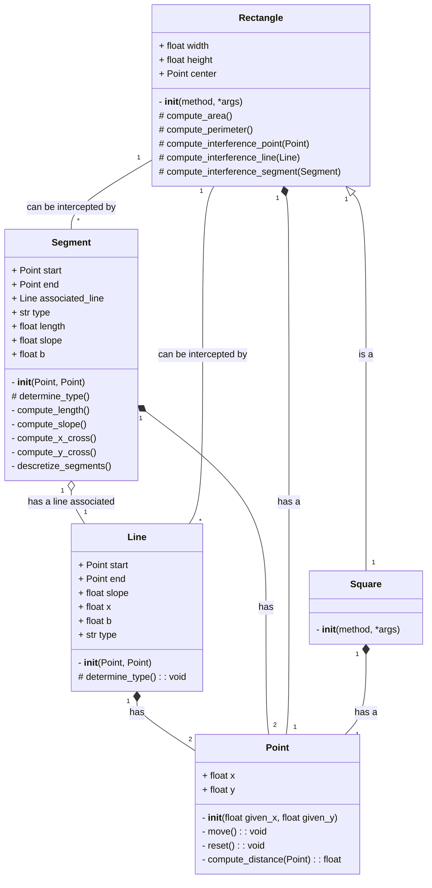

# Rectangle class diagram and line exercise

To make this exercise five classes were created: Point, Segment (originally asked as "Line" in the requirements), Line (extra class), Rectangle and Square. Point illustrates composition at its best as all the other classes have at least an object of Point. Segment and Line together show an aggregation relation and even polymorphism with the method ``determine_type()``, while the Rectangle class uses all the other classes (except Square) inside its methods. Lastly, Square is the perfect example of inheritance as it is initialized calling the initializer of Rectangle. The [code implementation](./exercise_rectangle_composition.py) can be executed and it will create at least an object of each class and try the most interesting methods of each.

 

